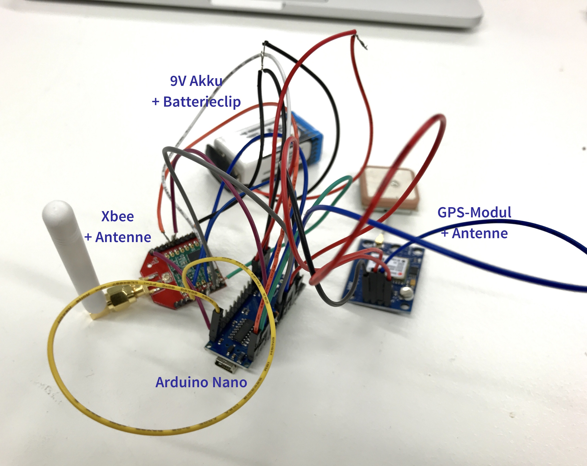

*If you want to track your bike or even your dog, you will quickly end up with price-intensive SIM card trackers on a subscription basis when looking for a suitable **GPS tracker**. With the help of the last two workshops of the open workshop in [CityLAB Berlin](https://www.citylab-berlin.org/) we wanted to demonstrate that GPS tracking doesn't have to be expensive. Because there is a much wider and more resource-saving network which can be used for tracking: the **LoRaWan**.*

## LoRaWan in theory

The **Long Range Wide Area Network** is a standard network transmission protocol developed by Nicolas Sornin in 2007, which belongs to the **Low Power Wide Area Networks** class. Accordingly, the LoRaWan is designed to transmit data packets over long distances (200 m to 20 km) with very low energy consumption in the so-called ISM band (Industrial, Scientific and Medical Frequency Range) at 868 MHz in Europe and 915 MHz in North America. Because of its characteristics, the use of LoRaWan for communication between various **sensors and IoT applications in the industrial sector** has already proven itself. For example, measured values from weather stations, water tanks, truck tires, refuse bins or even fine dust measuring devices are recorded by sensors and transmitted via LoRaWan technology to other networks such as the Internet. The LoRaWan architecture is quite simple:



<!--  -->

The device, also called end node, sends the measured data to a LoRaWan gateway via the LoRaWan protocol. The gateway in turn sends the data to a network server to which ones own personal application, such as an analytics tool, a card or a database, is connected and can be read and controlled by the user. 

## Fields of application in practice

Anyone who now wonders why we still pay at all for mobile network & internet when there seems to be a free network, will unfortunately be disappointed. Because the **data transmission rate of the LoRaWan ranges from 292 bit/s to a maximum of 50 kBit/s** and is therefore primarily suitable for the use of various IoT applications and sensors. In addition, LoRa has a high capacity: up to **one million nodes per application** are conceivable.



<!--  -->

We are talking here about devices that send small a data packets (keyword: narrow band) in regular intervals - usually at intervals of a few minutes, **not in real time** - over long distances with low energy consumption. No data-intensive packets, such as photos or videos, may be transmitted at too short intervals, since the Federal Network Agency regulates how much **Airtime** the LoRaWan may occupy on the 868 MHz frequency: **Maximum 1%**. Nevertheless, the fields of application for LoRaWan are versatile.  


&nbsp;

## Explore LoRaWan together with the CityLAB

The last two workshops of the so called 'Offene Werkstatt' in [CityLAB Berlin](https://www.citylab-berlin.org/) were dedicated to the topic **GPS Tracking with LoRaWan**. The participants were guided through our [instruction on GitHub](https://github.com/technologiestiftung/workshops/blob/master/HowTo_GPSTracker.md) with appropriate hard- and software and finally – with the help of LoRa-Nodes, but also smaller components like the [Dragino LoRaBee](https://www.dragino.com/products/lora/item/109-lora-bee.html) – data was transferred via the LoRa-Net. 

In the last workshop we built an optimized tracker. In contrast to the LoRa nodes, the individual components were put together so that we ended up building a very robust variant (soldered) with a very small packing size.


### A little foretaste


<!--  -->

The following hardware components are required for this LoRa GPS tracker:
* 9V batteries + charger (order [HERE](https://www.amazon.de/Ladeger%C3%A4t-Keenstone-aufladbare-Batterien-USB-Ladekabel-6-St-3-Slots-Ladegeraet/dp/B07BRKJV3J/ref=sr_1_2?__mk_de_DE=%C3%85M%C3%85%C5%BD%C3%95%C3%91&keywords=9+volt+battery+800mAh+keenstone&qid=1568196073&s=computers&sr=8-2) possible)

* Battery clip (order [HERE](https://www.amazon.de/KEESIN-Batterieknopf-2-1x5-5mm-Netzstecker-Batteriehalter/dp/B06Y41ZRVJ/ref=sr_1_4?__mk_de_DE=%C3%85M%C3%85%C5%BD%C3%95%C3%91&keywords=batterieclips&qid=1568195706&s=computers&sr=1-4) possible)

* GPS module with antenna (order [HERE](https://www.az-delivery.de/products/neo-6m-gps-modul?_pos=3&_sid=1c09a6176&_ss=r&ls=de) possible)

* Arduino Nano (Order [HERE](https://www.amazon.de/AZDelivery-Atmega328-gratis-Arduino-kompatibel/dp/B078S8BJ8T/ref=sr_1_9?__mk_de_DE=%C3%85M%C3%85%C5%BD%C3%95%C3%91&keywords=arduino+nano&qid=1568196529&s=ce-de&sr=1-9) possible)

* LoRa Bee (order [HERE](https://www.exp-tech.de/module/wireless/funk/7769/dragino-lora-bee-868) possible)

Taken together we come up with **costs of only 30€** per tracker and are thus far below the price of the usual GPS trackers, which usually start at 50€.  
&nbsp;

As soon as all components are soldered together, the hardware part is finished. On the software side it is now necessary to register the tracker in **[The Things Network (TTN)](https://thethingsnetwork.org)** and thus assign a corresponding device address, as well as a network session key and an app key. Finally we need these three key attributes for the program code (also called *Sketch* under Arduino), which is played on the Arduino Nano V3 microcontroller. Detailed instructions for registering the endnode in the TTN console** including screenshots of the user interface can be found at [adafruit.com](https://learn.adafruit.com/the-things-network-for-feather?view=all).  

Once the device is registered, the necessary **three variables that need to be added in the sketch** can be scraped from the TTN console. You can find the Sketch aka. program code [here on GitHub](https://github.com/technologiestiftung/workshops/blob/master/codes_sketches/) - name: *GPSTracker_LoRa_Nano_V2.ino*

The following lines have to be adjusted in the code:

```js
//*** Werte bekommt Ihr aus der TTN-Console, Format msb! ***
static u1_t NWKSKEY[16] = {
    0xB2, 0x5F, 0x35, 0x64, 0xB4, 0x89, 0xB8, 0x09, 0x08, 0x12, 0x7D, 0xAC, 0x0F, 0xC6, 0xF1, 0x5C
    }; 
    
static u1_t APPSKEY[16] = {
    0xB2, 0x5B, 0x16, 0x81, 0x53, 0x70, 0x49, 0xBF, 0x24, 0xBD, 0x55, 0xB2, 0xB5, 0xF6, 0xCB, 0x46
    }; 

// ACHTUNG: DEVICE ADRESSE MIT PRÄFIX 0x
// *** Wert bekomt Ihr aus der TTN-Console,Format hex-Style! ***
static const u4_t DEVADDR = 0X26011BF4
```

You should also check the pinmapping of the Dragino LoRa Bee before uploading the sketch. According to our circuit diagram you get the following pinmapping:

```js
const lmic_pinmap lmic_pins = {
    .nss = 10,
    .rxtx = LMIC_UNUSED_PIN,
    .rst = 9,
    .dio = {2, 6, 7},
    };
```

The pin mapping only needs to be adjusted if you deviate from our circuit diagram. The schematic as well as the instructions can be found on Github in the Markdown ["How To GPS Tacker (optimized)"](https://github.com/technologiestiftung/workshops/HowTo_GPSTracker_optimized.md).

**Last but not least** the sketch has now to be transferred to the Arduino Nano. To do this, click on **Verify** (hook in the upper left corner of the IDE) and compile the code. If no error message appears, the sketch can be loaded directly onto the board by clicking on **Upload**. Done!


If you want to experiment at home and set up a weather station on your terrace, you can ** borrow a Lora-Node + accessories for free via [Hacking Box](https://www.technologiestiftung-berlin.de/hackingbox/).** Otherwise we are always open for suggestions, discussions, questions, hints and tips about GPS-Tracking with LoRaWan!
