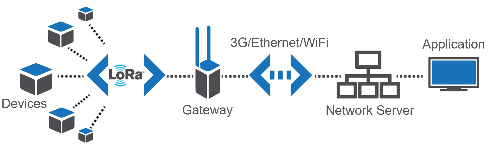
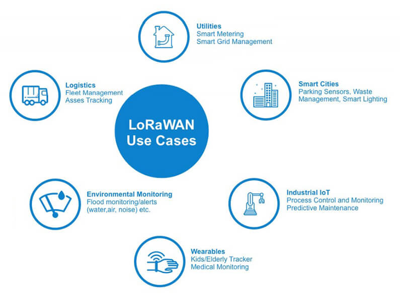

*If you want to use a **GPS tracker** to keep tabs on your bike or even your dog, you'll quickly find yourself looking at pricey SIM card trackers available only on a subscription basis. With the help of the last two events hosted at the the [CityLAB Berlin's](https://www.citylab-berlin.org/) "Open Workshop", we wanted to demonstrate that GPS tracking doesn't have to be expensive. Indeed, there is a network out there that both has greater reach and is more resource-efficient than mobile internet: **LoRaWan**.*

## LoRaWan in theory

The **Long Range Wide Area Network** (LoRaWan) is a standard network transmission protocol developed by Nicolas Sornin in 2007, which belongs to the **Low Power Wide Area Networks** class. Accordingly, LoRaWan is designed to transmit data packets over long distances (ranging from 200 m to 20 km) with very low energy consumption in the so-called ISM band (Industrial, Scientific and Medical Frequency Range) at 868 MHz in Europe and 915 MHz in North America. Because of these characteristics, the use of LoRaWan for communication between various **sensors and IoT applications in the industrial sector** has already proven itself. For example, sensors can record measurement values from weather stations, water tanks, truck tires, garbage bins or even particulate matter measuring devices and transmit this data via LoRaWan technology to other networks such as the internet. The LoRaWan architecture is quite simple:



<!--  -->

The device, also called an end node, sends the measured data to a LoRaWan gateway via the LoRaWan protocol. The gateway in turn sends the data to a network server connected to the user's own personal application, such as an analytics tool, a card or a database; the data can then be read and controlled by the user. 

## Areas of application

Anyone now wondering why we still pay for mobile network & internet when there seems to be a perfectly good alternative – and free – network available is unfortunately going to be disappointed: the **data transfer rate of the LoRaWan only ranges from 292 bit/s to a maximum of 51 kBit/s**. When using the LMIC library, which we used in our example code below to transfer data, 13 bytes of the maximum 51 bytes are reserved for so-called overhead data, i.e. metadata. The maximum data packets are therefore much smaller compared to Ethernet (easily up to 1,500 MBit/s) or the internet (100 MBit/s usual for home use), which is why LoRaWan is primarily suitable for the use of various **IoT applications and sensors**.



<!--  -->

With LoRaWan, we're talking about devices that can send small data packets (keyword: narrow band) at regular intervals (usually every few minutes, but **not in real time**) over long distances with low energy consumption. It isn't possible to send data-intensive packets (like photos or videos) at short time intervals, as the Federal Network Agency (German: *Bundesnetzagentur*) regulates how much **airtime** LoRaWan can occupy on the 868 MHz frequency: **a maximum of 1%**. Nevertheless, the fields of application for LoRaWan are versatile, as the network has a very high capacity: up to **one million nodes per application** are possible.


## Explore LoRaWan together with the CityLAB

The last two editions of the so called "Open Workshop" (German: *Offene Werkstatt*) at the [CityLAB Berlin](https://www.citylab-berlin.org/) were dedicated to the topic of **GPS Tracking with LoRaWan**. Participants were equipped with our [instructions on GitHub](https://github.com/technologiestiftung/werkstatt) as well as with the necessary hardware, software and other components like the [Dragino LoRaBee](https://www.dragino.com/products/lora/item/109-lora-bee.html) to transfer location data via the LoRa-Net.

In the most recent workshop, we built an optimized tracker. In contrast to the LoRa nodes, this tracker featured individual components that were put together, leading to a more robust (thanks to soldering) as well as compact version of the tracker.


### A little preview


<!--  -->

The following hardware components are required for this LoRa GPS tracker:
* 9V batteries + charger
* Battery clip 
* GPS module with antenna 
* Arduino Nano V3 (Clone)
* Dragino LoRa Bee 868 (European frequency)

Added up, these parts amount to **just 30€** per tracker – far below the price of the normal GPS trackers, which usually start at 50€.  

As soon as all these components are soldered together, the hardware part is finished. On the software side, it's now necessary to register the tracker in **[The Things Network (TTN)](https://thethingsnetwork.org)** and through that assign to our device a corresponding device address, as well as a network session key and an app key. We'll need these three keys for the program code (also called *Sketch* under Arduino), which will be loaded onto the Arduino Nano V3 microcontroller. Detailed instructions for **how to register your end node in the TTN console**, including screenshots of the user interface, can be found [here](https://www.thethingsnetwork.org/docs/devices/registration.html#personalize-device-for-abp) at The Things Network.

Once the device is registered, you can get **the aforementioned three variables** (device address, network session key and app key) from the TTN console. You can find the Sketch (i.e., the program code) [here on GitHub](https://github.com/technologiestiftung/werkstatt/tree/master/codes_sketches) – name: *GPSTracker_LoRa_Nano_V2.ino*

The following lines need to be adjusted in the code:

```js
//*** Werte bekommt Ihr aus der TTN-Console, Format msb! ***
static u1_t NWKSKEY[16] = {
    0xB2, 0x5F, 0x35, 0x64, 0xB4, 0x89, 0xB8, 0x09, 0x08, 0x12, 0x7D, 0xAC, 0x0F, 0xC6, 0xF1, 0x5C
    }; 
    
static u1_t APPSKEY[16] = {
    0xB2, 0x5B, 0x16, 0x81, 0x53, 0x70, 0x49, 0xBF, 0x24, 0xBD, 0x55, 0xB2, 0xB5, 0xF6, 0xCB, 0x46
    }; 

// ACHTUNG: DEVICE ADRESSE MIT PRÄFIX 0x
// *** Wert bekomt Ihr aus der TTN-Console,Format hex-Style! ***
static const u4_t DEVADDR = 0X26011BF4
```

You should also check the pin mapping of the Dragino LoRa Bee before uploading the sketch. Based on our circuit diagram, you should have the following pin mapping:

```js
const lmic_pinmap lmic_pins = {
    .nss = 10,
    .rxtx = LMIC_UNUSED_PIN,
    .rst = 9,
    .dio = {2, 6, 7},
    };
```

The pin mapping only needs to be adjusted if you deviate from our circuit diagram. The diagram as well as the instructions can be found on Github in the document ["How To GPS Tacker (optimized)"](https://github.com/technologiestiftung/werkstatt/blob/master/HowTo_GPSTracker_optimized.md).

**Last but not least** the Sketch has now to be transferred to the Arduino Nano. To do this, click on **Verify** (the checkmark in the upper left corner of the editor) and compile the code. If no error message appears, the sketch can be loaded directly onto the board by clicking on **Upload**. Done!


If you want to experiment at home and set up a weather station on your terrace, you can **borrow a Lora-Node + accessories for free via the [Hacking Box](https://www.technologiestiftung-berlin.de/hackingbox/).** Otherwise we are always open for suggestions, discussions, questions, hints and tips about GPS-Tracking with LoRaWan!

If you have any questions about LoRaWan and IoT networks, our colleague [Christian Hammel](mailto:Hammel@technologiestiftung-berlin.de) would be happy to help you. If you have any questions regarding the work of the *Werkstatt* at the CityLAB or the *Ideation & Prototyping Lab*, [Sara Reichert](mailto:Reichert@technologiestiftung-berlin.de) and [Julia Zimmermann](mailto:Zimmermann@technologiestiftung-berlin.de) are looking forward to your message.